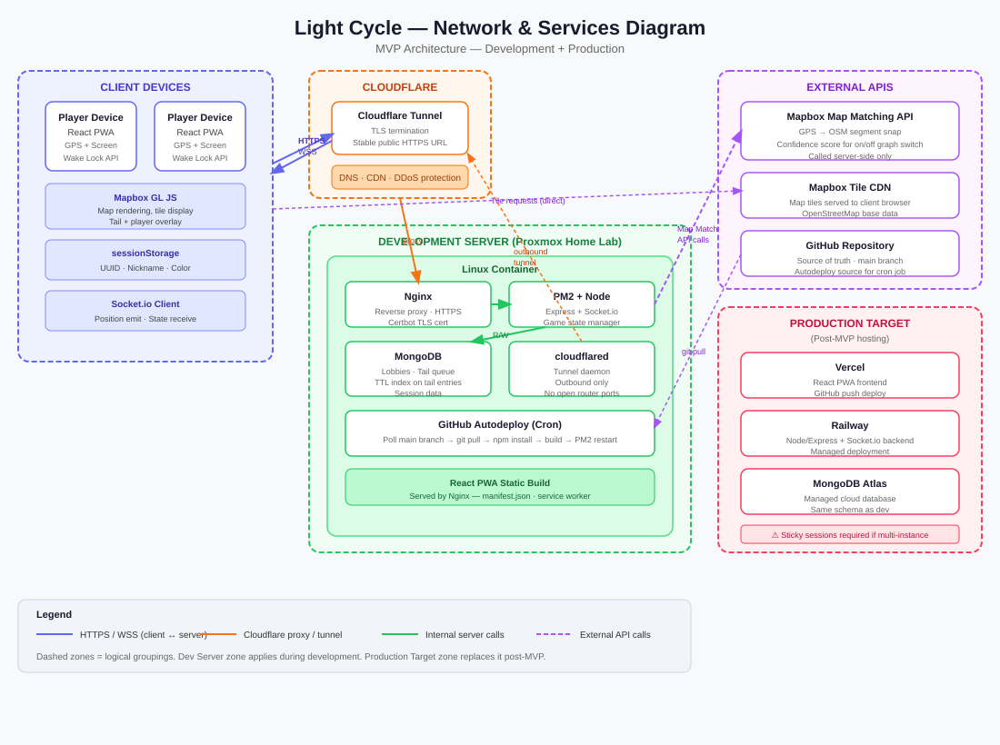

# Light Cycle 🚲

A real-time multiplayer cycling game inspired by Tron light cycles, played on bicycles in the real world. Players ride city streets leaving length-limited path tails behind them, which grow with every power-up. Cross another player's tail at an intersection and you're eliminated. Last rider wins.

Built as a Progressive Web App targeting Portland, Oregon.

> **Proprietary.** The source is published for viewing only; see [License](#license). Deployment and
> operations are documented in [RUNBOOK.md](RUNBOOK.md).

---

## Project Status

| Goalpost | Description | Status |
|---|---|---|
| 1 | Single-Player Snake — GPS pathing, tail rendering, self-collision, power-ups | 🟨 Built — awaiting outdoor validation |
| 2 | Multiplayer Sync — WebSocket position broadcast, lobby system, multi-player tails | 🔲 Not Started |
| 3 | Full Tron LightCycle — Map matching, intersection collision, geofence, game rules | 🔲 Not Started |

### Goalpost 1 deliverables

| Deliverable | Status |
|---|---|
| PWA manifest, service worker, generated icon set | ✅ |
| Screen Wake Lock integration (with re-acquire on visibility change) | ✅ |
| Geolocation watch, high accuracy mode | ✅ |
| GPS smoothing + outlier rejection | ✅ |
| Mapbox GL JS map, player marker, camera follow | ✅ |
| Tail polyline rendering with age gradient | ✅ |
| Tail length limit (500 m, +150 m per power-up) | ✅ |
| Power-up placement + proximity collection | ✅ snapped to the street graph |
| Self-collision detection | ✅ proximity + crossing-angle filter |
| Game state machine (idle → locating → configuring → active → eliminated) | ✅ |
| Minimal game UI + live diagnostics panel + ride-log export | ✅ |
| Pre-ride setup: node count + play zone | ✅ pulled forward from Goalpost 3 |
| **Outdoor device testing on a bicycle** | 🔲 **the actual goalpost** |

### The play zone

Pulled forward from Goalpost 3 because Goalpost 1 was otherwise field-testing a game that
can't really be lost: with a tail that falls away behind them, a rider escapes any developing
situation by riding in a straight line. A boundary is what forces the doubling-back
that creates the danger.

Once your position is known, a setup sheet appears over the map. Set the number of power-up
nodes (0–20) and drag the four corners of the play zone. Leaving the zone starts a 20 s
countdown with a full-width alarm and distance-out readout; come back in and it clears, stay
out and you're eliminated. Nodes are placed inside the zone only.

The zone is stored as an ordered ring with no fixed corner count and containment is a general
point-in-polygon test, so the freehand, polygon, exclusion-zone and street-boundary tools
parked in `docs/future-directions.md` slot in without changing the data model.

### What "verified" means here

Everything ticked above is verified by driving a simulated ride into the browser (by
replacing `watchPosition`), in **both** the dev server and the production build:

- Crossing your own trail eliminates — 90°, 570 m back along the tail.
- Riding back down your own street 5 m away does **not** eliminate. This is the property
  that decides whether the game is playable at all.
- All 8 power-up nodes land on real streets and paths — independently re-queried, every
  one within 0.1 m of a rideable way.

**None of it is verified against real GPS on a moving bicycle.** Simulated fixes are
clean; real ones jitter, drop out between buildings, and arrive at an unpredictable rate.
The outdoor ride is the only thing that closes Goalpost 1, and it is likely to change
numbers in `client/src/config/gameConfig.ts`.

One measurement already worth watching: on a noiseless synthetic route the diagnostics
panel reported a **12 m mean smoothing shift**, which is pure lag from `smoothingWindow: 4`
at 8 m point spacing. Real noise will change that trade-off. If the trail feels like it
lags behind you outdoors, that's the knob.

---

## Tech Stack

| Layer | Technology | Status |
|---|---|---|
| Runtime | Node 24.19 LTS, npm 11 | in use |
| Frontend | React 19 + TypeScript 7 (Vite 8 / rolldown) | in use |
| Client state | zustand 5 | in use |
| Map rendering | Mapbox GL JS 3 | in use |
| Power-up placement | Mapbox Tilequery API (public token) | in use |
| PWA | manifest.json + service worker | in use |
| Backend | Node.js + Express + TypeScript | Goalpost 2 |
| Real-time | Socket.io | Goalpost 2 |
| Database | MongoDB | Goalpost 2 |
| Map matching | Mapbox Map Matching API (cycling profile, secret token) | Goalpost 3 |
| Map data | OpenStreetMap via Mapbox tiles | in use |

---

## Repository Structure

As built. `server/` does not exist yet — it arrives with Goalpost 2.

```
light-cycle/
├── client/
│   ├── public/
│   │   ├── manifest.json    # PWA manifest
│   │   ├── sw.js            # Service worker (network-first shell, not offline-first)
│   │   └── icons/           # Generated — see scripts/generate-icons.mjs
│   └── src/
│       ├── components/      # MapView, Hud, StartScreen, EliminatedScreen, DebugPanel
│       ├── config/
│       │   └── gameConfig.ts    # ★ every tunable threshold, in one place
│       ├── game/            # tail.ts, collision.ts, powerups.ts — no React in here
│       ├── hooks/           # useGeolocation, useWakeLock, useGameTick
│       ├── pages/           # Game.tsx (single screen at Goalpost 1)
│       ├── services/        # mapbox.ts, tilequery.ts
│       ├── store/
│       │   └── gameStore.ts     # ★ the state machine; all logic funnels through here
│       └── utils/           # geo.ts, smoothing.ts, palette.ts
├── shared/
│   └── types.ts             # Shared interfaces + the full Socket.io contract (Goalpost 2)
├── scripts/
│   ├── generate-icons.mjs   # Zero-dependency PNG icon generator
│   └── with-node.sh         # Activates the .nvmrc Node for dev/preview
├── docs/                    # PRD, MVP scope, schema, future directions, network diagram
└── RUNBOOK.md               # Hosting, Proxmox dev server, tunnel, field testing
```

The two starred files are where almost all tuning happens. `client/src/game/` is
deliberately free of React so the rules can be exercised without a browser.

---

## Getting Started

See **[RUNBOOK.md](RUNBOOK.md)** for the full setup: local development, Mapbox tokens, Cloudflare Workers Builds playtest hosting, Access, the Proxmox LXC dev server with Nginx, PM2, MongoDB and Cloudflare Tunnel, the autodeploy cron, and field testing.

### Quick local start

Goalpost 1 is client-only — no server, no MongoDB. Those arrive with Goalpost 2.

```bash
nvm use          # Node 24 LTS, pinned in .nvmrc
npm install
cp client/.env.example client/.env
# add VITE_MAPBOX_PUBLIC_TOKEN (pk.…) to client/.env
npm run dev
# http://localhost:5173 — also served on your LAN IP for phone testing
```

**Node 24 LTS is required**, not optional: Vite 8 bundles with rolldown, which needs
Node ≥ 20.12 and otherwise dies with an opaque `node:util does not provide an export
named 'styleText'`. `engine-strict=true` in `.npmrc` turns that into a clear error, and
`npm run dev` / `npm run preview` activate the pinned version via `scripts/with-node.sh`
when nvm is present.

The game runs without a Mapbox token, on a blank grid backdrop, so the GPS and collision
logic can be worked on before you have one. You just won't see streets.

To ride outdoors you need HTTPS — geolocation is refused otherwise. Either use the
Cloudflare Tunnel from the [runbook](RUNBOOK.md#5-proxmox-dev-server), or `npm run build && npm run preview` behind it.

### Environment Variables

**Client** (`client/.env`) — the only one that exists today:
```
VITE_MAPBOX_PUBLIC_TOKEN=pk.ey... # Public token — styles:read + tiles:read
VITE_API_URL=http://localhost:3001    # Goalpost 2+, currently unused
VITE_WS_URL=ws://localhost:3001       # Goalpost 2+, currently unused
```

**Server** (`server/.env`) — from Goalpost 2:
```
PORT=3001
MONGODB_URI=mongodb://localhost:27017/lightcycle
MAPBOX_API_TOKEN=sk.ey...        # Secret key — server only
CORS_ORIGIN=https://yourdomain.com
NODE_ENV=development
```

> ⚠️ The server Mapbox token is a secret key with Map Matching API access. Never expose it to the client. The client token should be a restricted public token.
>
> The client rejects a token starting with `sk.` on purpose and says why, so a secret key
> pasted into `client/.env` fails loudly instead of shipping in a browser bundle.

---

## The outdoor test — what Goalpost 1 still needs

Geolocation requires a secure origin, so `localhost` on the laptop works but the phone
does not. Get an HTTPS URL onto the device via the Cloudflare Tunnel in the [runbook](RUNBOOK.md#5-proxmox-dev-server),
then ride.

What to watch, and where it lands in [`gameConfig.ts`](client/src/config/gameConfig.ts):

| Question | Read from | Knob |
|---|---|---|
| How noisy is bike GPS really? | Debug panel — raw accuracy, rejection counts | `gps.maxAccuracyMeters` |
| What fix rate do you actually get? | Debug panel — fix rate (Hz) | — |
| Does the trail lag behind you? | Debug panel — smoothing shift | `gps.smoothingWindow` |
| Any phantom eliminations? | Whether you die when you shouldn't | `collision.selfProximityMeters`, `graceMeters` |
| Does the crossing filter earn its keep? | Set `requireCrossing: false` and re-ride | `collision.requireCrossing` |
| Does the screen stay awake for a full ride? | "screen lock not held" pill | — |
| Is 20 s enough to get back inside the zone? | Whether exits feel fair or cheap | `geofence.graceSeconds` |
| Does the zone make the game tense or cramped? | Whether you ever feel boxed in | `geofence.defaultSizeMeters` |

The debug panel exports the whole ride as JSON — every state transition, fix, tail append,
placement result, zone crossing, collision and wake-lock event — so thresholds can be
re-examined at a desk instead of re-ridden. It survives a reload and keeps the previous
session too.

The log stores raw observations, not conclusions. To get the summary numbers out of it:

```bash
node scripts/analyse-ride.mjs ~/Downloads/light-cycle-current-123.json
```

That prints fix rate, accuracy percentiles, smoothing shift, rejections by cause, tail
growth, placement road classes, zone crossings, collisions (with the position resolved from
the adjacent fix) and the wake-lock timeline.

---

## Known deviations from the spec

Three things are built differently from `docs/mvp-scope.md`, all deliberate and all reversible
from `gameConfig.ts`. They are recorded in that document's Implementation Notes too.

1. **Self-collision is proximity + a crossing-angle filter**, not proximity alone. Pure
   proximity kills you the moment you double back along a street you already rode, which
   contradicts `docs/prd.md` §10.1 and makes the game unplayable.
2. **Power-ups are snapped to the rideable street graph** rather than placed at fixed
   coordinates, via the Mapbox Tilequery API. A purely geometric scatter put nodes in the
   Willamette and inside city blocks.
3. **The geofence arrived in Goalpost 1** instead of Goalpost 3, and is enforced client-side
   rather than server-side. Without it the field test measures a game with no losing
   condition. It moves to the server with everything else at Goalpost 3.

---

## Game Rules (MVP — Multiplayer Snake Mode)

- All players ride simultaneously within a geofenced play zone
- Every player leaves a path tail behind them as they ride
- Tails are limited by length: 500 m to start, and every power-up collected adds 150 m (both set by the host at lobby creation). Standing still never shortens a tail
- **A player is eliminated when they cross another player's active tail — or their own — at an intersection**
- Two players riding the same street in any direction is **not** a collision — only perpendicular crossings at intersections count
- Last player remaining wins

---

## Hosting

| Environment | Where | How it deploys |
|---|---|---|
| Playtest (current) | Cloudflare Workers, assets-only Worker serving `client/dist` | **Workers Builds**: push to `main` deploys; other branches get preview URLs |
| Dev server | Proxmox LXC: Nginx, PM2, MongoDB, `cloudflared` | Cron polls `main` every 5 minutes, rebuilds and restarts |
| Production target (post-MVP) | Vercel (frontend), Railway (Socket.io server), MongoDB Atlas | — |

The Socket.io server at Goalpost 2 **cannot** live on Workers, which can't run a long-lived Node
process. The frontend stays on Workers and the server goes elsewhere, which is the split
[`docs/prd.md`](docs/prd.md) already plans. Every step is in [RUNBOOK.md](RUNBOOK.md).



---

## Documentation

Each planning document starts with a status banner saying what is and isn't implemented.

| Document | Description |
|---|---|
| [RUNBOOK.md](RUNBOOK.md) | Setup, hosting, Proxmox dev server, tunnel, autodeploy, field testing, troubleshooting |
| [docs/mvp-scope.md](docs/mvp-scope.md) | Three-goalpost validation plan, success criteria, deliverable checklists, implementation notes |
| [docs/prd.md](docs/prd.md) | Product requirements: full feature and technical spec |
| [docs/schema.md](docs/schema.md) | MongoDB schema: collections, fields, indexes (Goalpost 2) |
| [docs/future-directions.md](docs/future-directions.md) | Parking lot: deferred ideas and trigger conditions |
| [docs/network-diagram.svg](docs/network-diagram.svg) | Network and services architecture (target state) |

---

## License

**Copyright © 2026 Stuart McKay. All rights reserved.**

This repository is public for viewing and evaluation only. No license is granted to use, copy,
modify, distribute, host or create derivative works of any part of it. See [LICENSE](LICENSE).
For licensing inquiries, open an issue.
